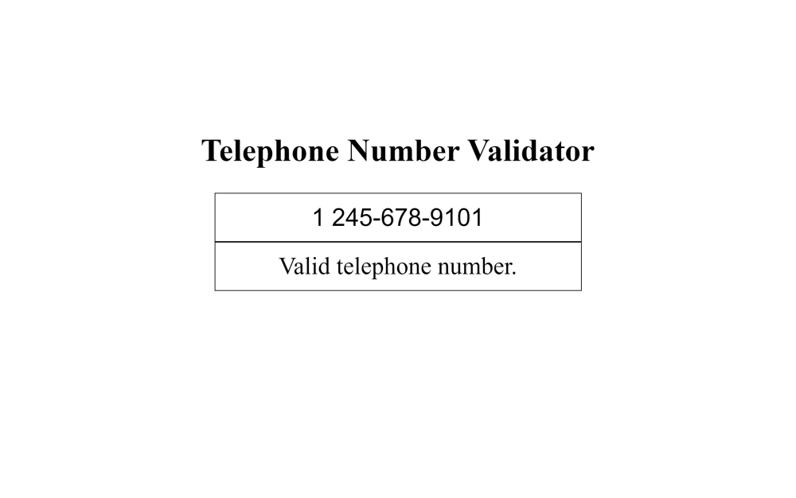

# [freeCodeCamp JavaScript Algorithms and Data Structures certification](https://www.freecodecamp.org/learn/javascript-algorithms-and-data-structures/)

## [Telephone Number Validator project](https://www.freecodecamp.org/learn/javascript-algorithms-and-data-structures/javascript-algorithms-and-data-structures-projects/telephone-number-validator)

Working example: https://raff1010x.github.io/10.JavaScript-Algorithms-and-Data-Structures--Telephone-Number-Validator/

My git repo: https://github.com/Raff1010X/01.Roadmap

